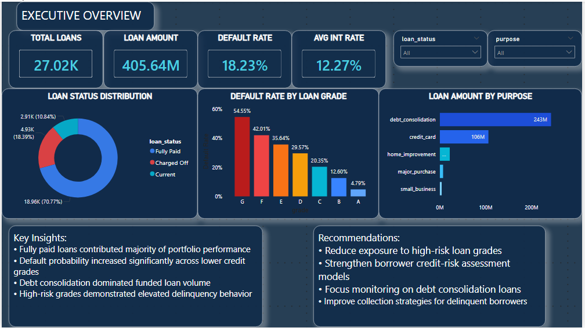
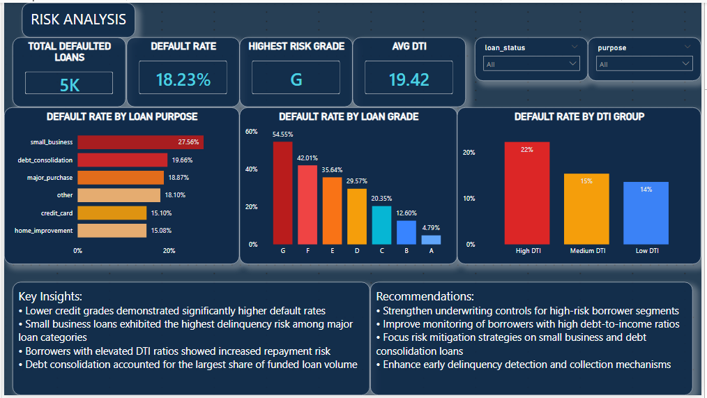
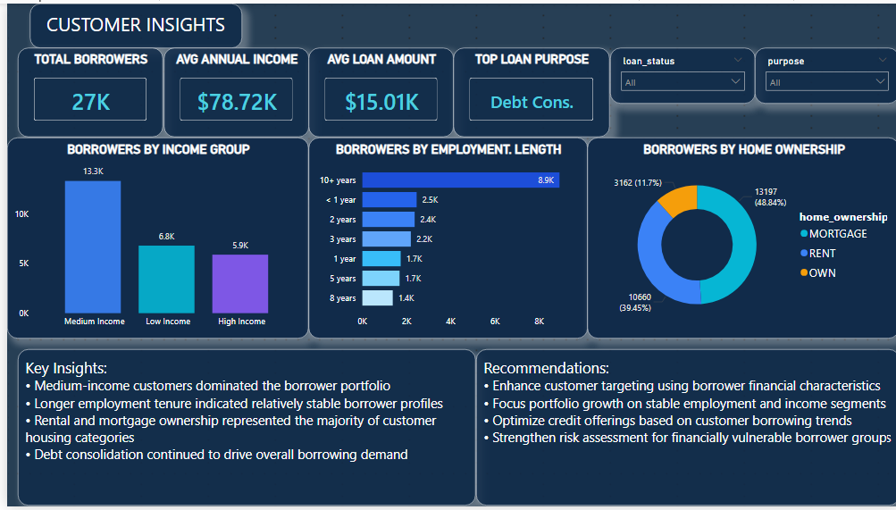

[](https://colab.research.google.com/drive/1tvDfM1_SAChyB1oCaz6HMkilakFSJspb#scrollTo=dloNVsC2ipFq)
# Lending Club Risk Analysis

## Overview

This project analyzes Lending Club loan data using SQL, Python, and Power BI to evaluate portfolio performance, borrower behavior, and credit risk. The analysis focuses on identifying default drivers, understanding borrower characteristics, and generating actionable insights to support risk management and lending decisions.

---

## Business Problem

Financial institutions must balance portfolio growth with credit risk management. Understanding borrower behavior and loan performance is essential for minimizing defaults and optimizing lending strategies.

This project addresses the following questions:

* Which borrower segments have the highest default risk?
* How do loan grades impact repayment performance?
* Which loan purposes contribute the most funded volume?
* What borrower characteristics are associated with higher risk?
* How can lending institutions improve portfolio quality?

---

## Tools & Technologies

* SQL
* Python
* Power BI
* Pandas
* NumPy
* Data Visualization
* Financial Analytics
* Credit Risk Analysis

---

# Dashboard Preview

## Executive Overview



### KPIs

* Total Loans: 27K+
* Total Loan Amount: $405M+
* Default Rate: 18.23%
* Average Interest Rate: 12.27%

### Key Insights

* Fully paid loans represent the majority of portfolio performance.
* Debt consolidation accounts for the largest funded loan volume.
* Default rates increase significantly across lower credit grades.
* Portfolio performance varies considerably by loan purpose.

---

## Risk Analysis



### Analysis Focus

* Default Rate by Loan Grade
* Default Rate by Loan Purpose
* Debt-to-Income Risk Analysis
* High-Risk Borrower Segmentation

### Key Insights

* Grade G loans recorded the highest default rates.
* Small business loans exhibited elevated risk levels.
* Borrowers with higher DTI ratios were more likely to default.
* Lower credit grades consistently underperformed higher grades.

---

## Customer Insights



### Analysis Focus

* Borrower Income Groups
* Employment Length Analysis
* Home Ownership Distribution
* Customer Demographics

### Key Insights

* Medium-income borrowers represented the largest segment.
* Longer employment tenure was associated with more stable borrower profiles.
* Mortgage and rental customers dominated the portfolio.
* Debt consolidation remained the most common borrowing purpose.

---

## SQL Analysis

SQL was used to:

* Calculate loan portfolio KPIs
* Analyze default rates by grade
* Evaluate loan purpose performance
* Segment borrowers by risk characteristics
* Generate portfolio performance reports

### Sample Analysis

* Default Rate by Grade
* Loan Amount by Purpose
* Borrower Risk Segmentation
* Portfolio KPI Reporting

---

## Python Analysis

Python was used for:

* Data Cleaning
* Exploratory Data Analysis (EDA)
* Missing Value Handling
* Risk Metric Calculation
* Feature Engineering
* Data Validation

Libraries Used:

* Pandas
* NumPy
* Matplotlib
* Seaborn

---

## Key Findings

### Credit Risk

* Default rates increased significantly among lower credit grades.
* Borrowers with high debt-to-income ratios demonstrated elevated repayment risk.
* Certain loan purposes showed consistently higher delinquency levels.

### Portfolio Performance

* Fully paid loans contributed the majority of portfolio value.
* Debt consolidation accounted for the largest share of funded loan volume.
* Portfolio quality varied substantially across borrower segments.

### Borrower Behavior

* Employment stability influenced repayment outcomes.
* Income levels were strongly associated with loan performance.
* Home ownership status provided additional risk signals.

---

## Recommendations

### Risk Management

* Tighten underwriting standards for lower-grade loans.
* Increase monitoring of high DTI borrowers.
* Implement early-warning systems for potential defaults.

### Portfolio Optimization

* Diversify exposure across loan categories.
* Focus growth on lower-risk borrower segments.
* Strengthen risk-based pricing models.

### Customer Strategy

* Improve borrower screening processes.
* Enhance financial education initiatives.
* Monitor high-risk loan purposes more closely.

---

## Repository Structure

```text
Lending-Club-Risk-Analysis
│
├── lending_club_analysis.sql
├── lending_club_analysis.ipynb
├── Lending_Club_Risk_Dashboard.pbix
├── dashboard_overview_1.png
├── dashboard_overview_2.png
├── dashboard_overview_3.png
└── README.md
```

---

## Skills Demonstrated

* SQL Querying
* Python Data Analysis
* Power BI Dashboard Development
* Credit Risk Analysis
* Financial Analytics
* Portfolio Monitoring
* Data Visualization
* KPI Reporting
* Business Intelligence

---

## Business Impact

This project demonstrates how data analytics can be used to identify credit risk drivers, improve portfolio monitoring, reduce default exposure, and support data-driven lending decisions. The insights generated can help financial institutions optimize portfolio performance while maintaining effective risk controls.

---

## Author

### Amr Khalid Kidwai

**Data Analyst | SQL | Python | Power BI | Product Analytics | Fintech Analytics**

LinkedIn: https://linkedin.com/in/amr-kidwai

GitHub: https://github.com/amrKidwai
